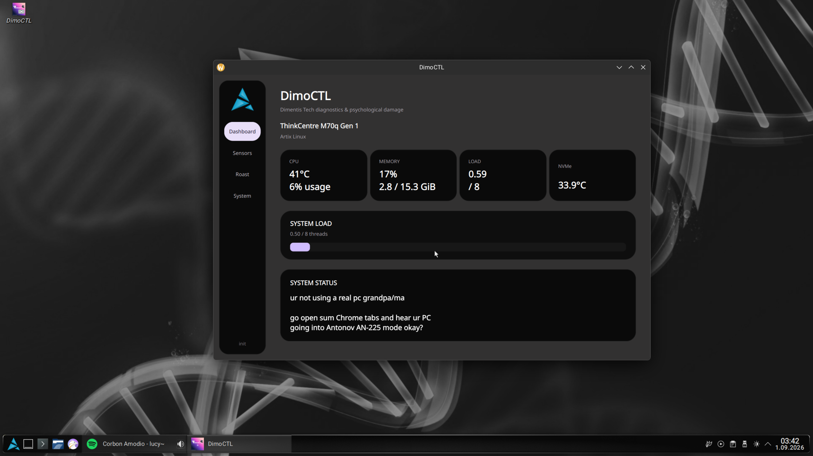

# DimoCTL
A lightweight desktop control utility for Linux.
# DimoCTL

> A lightweight desktop control utility built by Dimo.

DimoCTL is a desktop control utility designed to provide a simple and convenient interface for managing system-related controls and actions.

The project focuses on keeping the interface clean, lightweight, and easy to use without unnecessary complexity.

## Features

* 🖥️ Desktop graphical interface
* ⚡ Lightweight and responsive design
* 🎛️ Easy-to-use system controls
* 🧩 Modular project structure
* 🔧 Configurable behaviour
* 🐧 Linux-friendly development
* 📦 Designed with portability in mind

## Screenshots



> Screenshots may change as development continues.

## Installation

### From source

Clone the repository:

```bash
git clone https://github.com/YOUR_USERNAME/DimoCTL.git
cd DimoCTL
```

Then follow the build/run instructions for your current version.

```bash
# Example
./DimoCTL
```

> Replace the command above with the actual build/run command used by the project.

## Requirements

The exact requirements depend on the current DimoCTL build.

Typical requirements may include:

* Linux
* A supported desktop environment
* Required runtime/development libraries
* Git

## Development

Clone the repository:

```bash
git clone https://github.com/YOUR_USERNAME/DimoCTL.git
cd DimoCTL
```

Make your changes, test them locally, and submit a pull request if you'd like to contribute.

## Project Status

🚧 **DimoCTL is currently under active development.**

Features, UI elements, and internal components may change between releases.

## Roadmap

* [ ] Improve desktop scaling
* [ ] Improve HiDPI support
* [ ] Add more system controls
* [ ] Improve configuration handling
* [ ] Add proper release builds
* [ ] Add installation packages
* [ ] Improve documentation
* [ ] Add more desktop environment support

## Contributing

Contributions, bug reports, suggestions, and improvements are welcome.

Before opening an issue, please make sure the problem has not already been reported.

For larger changes, opening an issue first is recommended so the proposed change can be discussed.

## License

DimoCTL is licensed under the MIT License.

See [`LICENSE`](LICENSE) for more information.

## Author

**Dimo**

Made with code, questionable decisions, and way too much terminal usage. :3
